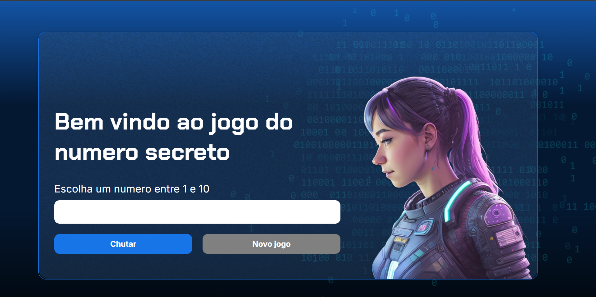

markdown
# 🕹️ Jogo do Número Secreto

O **Jogo do Número Secreto** é uma aplicação web interativa desenvolvida como parte do curso de Lógica de Programação da **Alura**. O projeto consiste em um jogo onde o usuário deve tentar adivinhar um número gerado aleatoriamente pelo sistema, recebendo dicas se o número secreto é maior ou menor do que o chute realizado.

<div align="center">
  
</div>

## 🚀 Funcionalidades

- Gerar um número secreto aleatório dentro de um intervalo pré-definido.
- Validação de tentativas do usuário.
- Feedback em tempo real informando se o número secreto é maior ou menor que o chute.
- Sistema de contagem de tentativas para exibir o resultado final com a concordância gramatical correta (ex: "1 tentativa" vs "2 tentativas").
- Reinicialização do jogo dinamicamente através do botão "Novo jogo".
- Interface responsiva com animações visuais e elementos gráficos modernos.

## 🛠️ Tecnologias Utilizadas

- **HTML5**: Estruturação dos elementos da página.
- **CSS3**: Estilização, layout moderno com degradê e posicionamento customizado.
- **JavaScript (ES6+)**: Lógica de programação, manipulação do DOM (Document Object Model), geração de números pseudo-aleatórios e controle de fluxo do jogo.

## 👨‍🏫 Instrutores do Curso

Este projeto foi desenvolvido sob a excelente orientação dos professores da Alura:
- **Guilherme Lima**
- **Mônica Mazzochi Hillman**

## 📂 Como Executar o Projeto

1. Clone este repositório para a sua máquina local:
   ```bash
   git clone [https://github.com/seu-usuario/Jogo-do-Numero-Secreto.git](https://github.com/seu-usuario/Jogo-do-Numero-Secreto.git)
